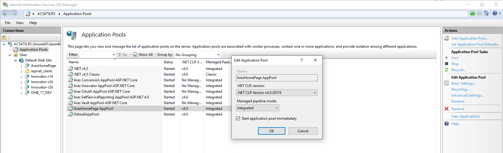
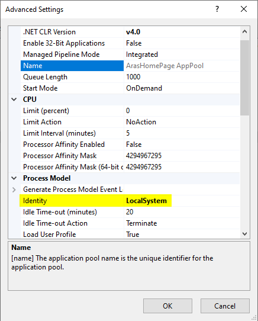
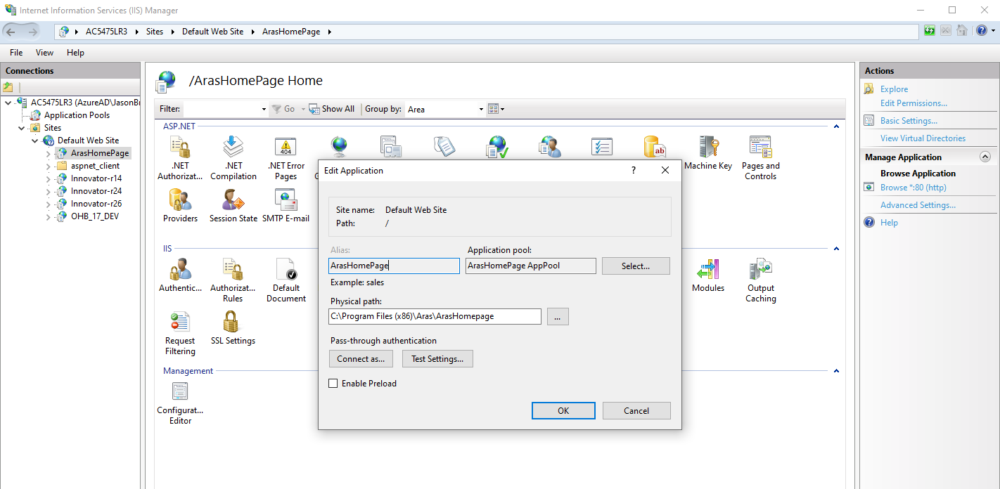
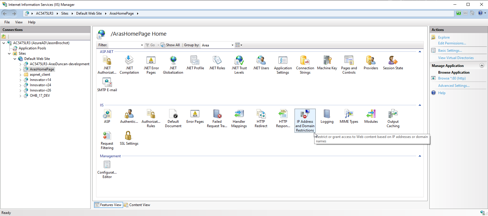
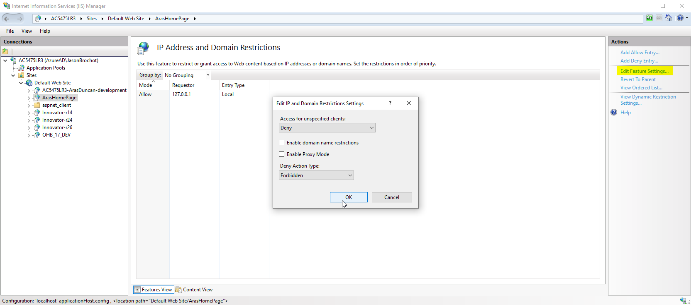
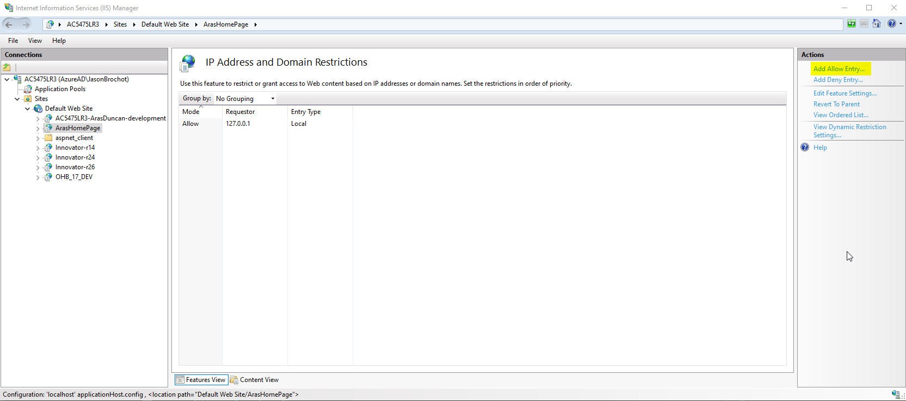
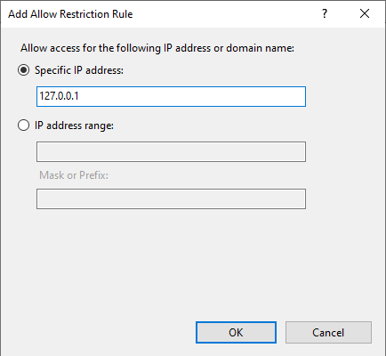
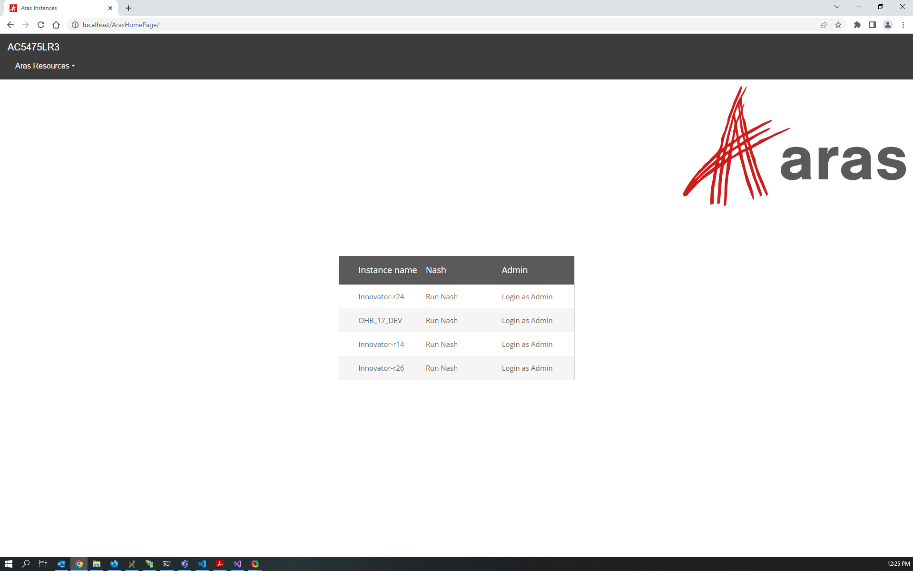

# ArasHomePage

Project forked from ArasLabs project [Aras-homepage](https://github.com/ArasLabs/aras-homepage).

This project sets up a "homepage" that lists the Aras Innovator instances installed on a server. The list contains links to each instance's login page and Nash page. The homepage acts as a directory for easy access to your Aras Innovator installations.

The server name (displayed on the top banner) is gathered dynamically.
The Aras instances links are gathered from IIS Applications (credits to [Chris Gillis](https://github.com/cgillis-aras)).

## Installation

### Install Steps

1. Download the ArasHomePage project.
2. Copy the `ArasHomepage` folder from the project and paste it on the server in the location where you want to store the sources of the application.

3. If you have links you want to show in a dropdown list from the navigation bar, you can add them to the `links_aras` Dictionary.

    ```(html)
    // create a dictionary of links you want to show in the aras dropdown list
	Dictionary<string,string> links_aras = new Dictionary<string,string>();
	links_aras["Aras Community"] = "https://community.aras.com/";
    ```
4. If you have links you want to show outside of the dropdown lists, you can add them in the `links` Dictionary.

   ```(html)
   // create a dictionary of links you want to show in the nav bar
   Dictionary<string,string> links = new Dictionary<string,string>();
   /*
   links["MyInnovator"] = "https://MyInnovator.com/";
   links["GitHub"] = "https://github.com/";
   links["Labs Blog"] = "http://community.aras.com/en/category/technique/aras-labs/";
   */
   ```

5. Save the `default.aspx` file.

6. Create an Application Pool dedicated to the ArasHomePage application

   _This will avoid permission error when the page will fetch the server links from IIS applications.To do so, we specify that when you access this page, the identity to use should be the LocalSystem. It is necessary to dispose of a dedicated application pool for this to avoid impacting other applications, and for security reasons._

   _Be advised, using the LocalSystem identity to run the application grants Administrator rights to the process which executes its code, it is a potential **security breach** and **it must be addressed** (see Step #9). While on most machines the admin rights will be necessary to list the applications deployed on IIS, using the LocalSystem identity may not be required depending on the configuration of the system. Other options like Windows Authentication may be considered, especially on shared resources like servers. Please refer to the section `Security Considerations` for more information._

   
   

   1. Open IIS Manager as admin
   2. Under <ServerName> -> Application Pools
   3. Select the action 'Add Application Pool' (top right of the window)
   4. Set the new Application Pool settings:
      1. Set a name (ie: 'ArasHomePage ASP.NET 4.0')
      2. Set a .NET CLR version (ie: '.NET CLR Version v4.0.30319')
      3. Set the 'Classic' option for the Managed pipeline mode
      4. Tick the box for the option 'Start the application pool immediately'
   5. Validate with OK button
   6. Set the identity 'LocalSystem' for the application pool
      1. Open the Application Pool advanced settings
      2. Under Process Model -> Identity, select the Identity 'LocalSystem'

7. Create a new application in IIS for ArasHomepage

   

   1. Open IIS Manager as Administrator
   2. Under <ServerName> -> Sites
   3. Right click on Sites and select the option 'Add Application...'
   4. Set the new application settings:
      1. Alias: 'ArasHomepage'
      2. Application pool: the dedicated application pool you just created
      3. Physical path: the path to the folder containing the file default.aspx of the ArasHomepage
      4. Authentication: pass through authentication
      5. Validate with OK button

8. Restart IIS

   After this step, you should be able to load the page in the browser of your choice

9. Restrict access to localhost only

   
   
   
   

   1. Open IIS Manager as Administrator
   2. Select <ServerName> -> Sites -> Default Web Site -> ArasHomePage
   3. Open the menu `IP Address and Domain Restrictions`
   4. Forbid to for unspecified clients
      1. From the pane on the right and side, open the menu `Edit Feature Settings...`
      2. Set `Access for unspecified clients` to `Deny`
      3. Set `Deny Action Type` to `Forbidden`
      4. Validate with OK button
   5. Add an allow rule for localhost
      1. From the pane on the right and side, open the menu `Add Allow Entry...`
      2. Set the address to  '127.0.0.1'
      3. Validate with OK button

   Now the application is only accessible from the machine itself.

### Security Considerations

The application needs to be able to list the applications deployed locally with IIS.
That typically implies running wiht the Administrators rights on the system.
There are a number of ways of achieving that through the authorization and authentication mechanisms provided by IIS Manager.

On a Server accessible by a number of machine on a network, access restriction to the application based on Windows Authentication would seem like a good solution. Typically you could restrict the access to the application to members of the Administrators group on the Server, or members of an AD group.

Though because this project is primarily intended for local development environments (meaning the PC of a developer with local Innovator instances), the preferred solution documented is to run the application with the LocalSystem identity, AND enforce strong restrictions on what machine can access the application.

## Usage



Open your browser to http://servername/ArasHomepage. Bookmark the url or make it your browser homepage for easy access to your server's Innovator instances.

> Note: The **Login as Admin** link only works for systems configured for Windows Authentication. For all other systems, it will just bring up the login page.

## Contributing

1. Fork it!
2. Create your feature branch: `git checkout -b my-new-feature`
3. Commit your changes: `git commit -am 'Add some feature'`
4. Push to the branch: `git push origin my-new-feature`
5. Submit a pull request

## Credits

This project was created by ArasLabs under the MIT License : available on GitHub [here](https://github.com/ArasLabs/aras-homepage)

It was originally created by [Eli Donahue](https://github.com/EliJDonahue) and inspired by George J. Carrette.
It includes contributions from [Sam Poe](https://github.com/sampoearas) and [Chris Gillis](https://github.com/cgillis-aras).

Table style is based on [this template](https://colorlib.com/etc/tb/Table_Responsive_v1/index.html).

Background photos of additional css styles are sourced from [UnSplash](https://unsplash.com/).
