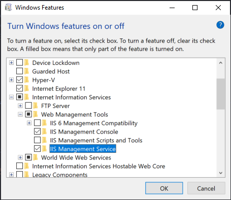
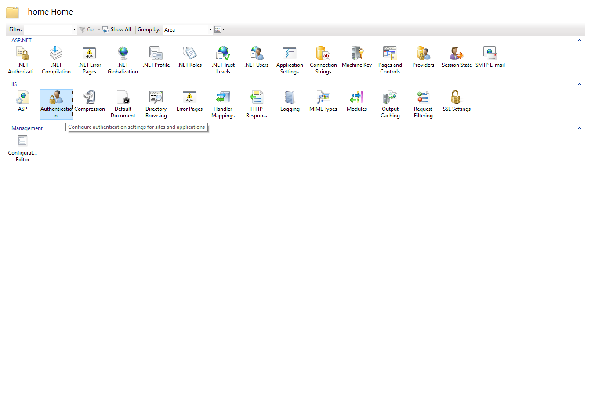
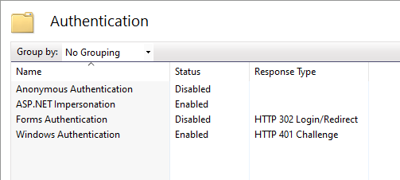

# Aras Homepage

This project sets up a "homepage" that lists the Aras Innovator instances installed on a server. The list contains links to each instance's login page and Nash page. The homepage acts as a directory for easy access to your Aras Innovator installations.

## History

Release | Notes
--------|--------
[v1.1.0](https://github.com/ArasLabs/aras-homepage/releases/tag/v1.1.0) | Added ability to populate instance list from IIS instead of folder.
[v1.0.0](https://github.com/ArasLabs/aras-homepage/releases/tag/v1.0.0) | First release. Tested on Internet Explorer, Edge, Firefox, Chrome.

#### Supported Aras Versions

Project | Aras
--------|------
[v1.1.0](https://github.com/ArasLabs/aras-homepage/releases/tag/v1.1.0) | All Aras Versions
[v1.0.0](https://github.com/ArasLabs/aras-homepage/releases/tag/v1.0.0) | All Aras Versions


## Installation

### Pre-requisites

This project requires you to have the IIS Management Service feature enabled. You can find this under the **Turn Windows Features on or off** dialog accessible through the Control Panel.



### Install Steps

1. Download the aras-homepage project.
2. Copy the `home` folder from the project and paste it into `C:\inetpub\wwwroot` on the server.
3. Open `home\default.aspx` for editing.
4. Set the server name in the nav bar.

    ```(html)
    <!-- Navbar content -->
    <a class="navbar-brand" href="#">SERVER NAME</a> 
    ```

5. If there are any subfolders you don't want listed in the table, add them to the skip list.

    ```(html)
    // create a list of folder names you don't want listed
    List<string> skip = new List<string>();
    skip.Add("Aras Update");
    ```

6. If you want to customize the background style, you can choose or edit a stylesheet.

    ```(html)
    <!-- 
    choose or customize a stylesheet to style the page background 
    find stylesheets in home/css/
    -->
	<link rel="stylesheet" type="text/css" href="css/blue-purple.css">
	<!-- <link rel="stylesheet" type="text/css" href="css/blue-green.css"> -->
	<!-- <link rel="stylesheet" type="text/css" href="css/photo.css"> -->
    ```

    Tip: Here's a great site with a gallery of color gradients: [https://uigradients.com/](https://uigradients.com/).

7. If you want to show custom links in the navigation bar, you can add them to the `links` Dictionary.

    ```(html)
    // create a dictionary of links you want to show in the nav bar
    Dictionary<string,string> links = new Dictionary<string,string>();
    links["MyInnovator"] = "https://MyInnovator.com/";
    ```

8. If you have links you want to show in a dropdown list from the navigation bar, you can add them to the `links_2` Dictionary.

    ```(html)
    // create a dictionary of links you want to show in the dropdown list
    Dictionary<string,string> links_2 = new Dictionary<string,string>();
    links_2["Aras Roadmap"] = "https://www.aras.com/plm-roadmap/";
    ```

9. Save the `default.aspx` file.

### IIS Setup

This project queries IIS to get a list of the applications it should use to populate the links on the homepage. To avoid a permissions error, you'll need to configure IIS to use Windows Authentation with your user instead of the default IIS user.

1. Open the IIS Manager
2. In the Connections tree on the left, select **Default Web Site > home**
3. Select **Authentication** in the features view



4. Set the Authentication as follows:
   1. Anonymous Authentication : **Disabled**
   2. ASP.NET Impersonation : **Enabled**
   3. Forms Authentication : **Disabled**
   4. Windows Authentication : **Enabled**

;

> Note: With the move towards a Windows authenticated user, you may be prompted for your Windows credentials upon accessing this home page for the first time. This happend when I tested in FireFox and Edge, but did not happen when I tested in Chrome. If you keep the browser session open, you should only need to enter these credentials a single time.

## Usage


*Screenshot demonstrates different custom styles. Project does not automatically rotate stylesheets.*

Open your browser to http://servername/home. Bookmark the url or make it your browser homepage for easy access to your server's Innovator instances.

> Note: The **Login as Admin** link only works for systems configured for Windows Authentication. For all other systems, it will just bring up the login page.

## Contributing

1. Fork it!
2. Create your feature branch: `git checkout -b my-new-feature`
3. Commit your changes: `git commit -am 'Add some feature'`
4. Push to the branch: `git push origin my-new-feature`
5. Submit a pull request

For more information on contributing to this project, another Aras Labs project, or any Aras Community project, shoot us an email at araslabs@aras.com.

## Credits

Created by Eli Donahue.

Modified by Christopher Gillis.

Project inspired by George J. Carrette.

Table style is based on [this template](https://colorlib.com/etc/tb/Table_Responsive_v1/index.html).

Background photos are sourced from [UnSplash](https://unsplash.com/).

## License

Aras Labs projects are published to Github under the MIT license. See the [LICENSE file](./LICENSE.md) for license rights and limitations.
